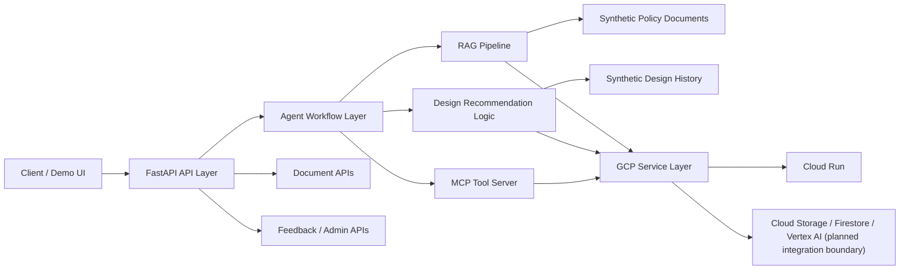

# GCP-based Insurance Design GenAI Agent PoC

GenAI Agent PoC for supporting insurance subscription design workflows. This project explores how a backend service can combine policy-document RAG, design-history-based recommendation, condition-change support, agent orchestration, and GCP deployment patterns in a single architecture.

This repository is intentionally built with synthetic sample data only. It does not include real internal enterprise data, real RFP originals, real customer information, or real production API specifications.

## 1. Project Overview

This project is a backend-oriented Proof of Concept for insurance design assistance. The goal is to validate whether a modular GenAI architecture can support practical planning tasks such as:

- retrieving relevant clauses from policy and product documents
- recommending design directions from historical subscription-design cases
- responding to changes in customer conditions or design constraints
- orchestrating multi-step reasoning through an agent workflow
- exposing domain tools through an MCP-compatible tool server
- packaging the application for GCP Cloud Run deployment

The current repository focuses on clean service boundaries, API scaffolding, and extensible architecture rather than production-complete business logic.

## 2. Why Refactoring

Insurance advisory workflows are document-heavy, rule-sensitive, and often evolve across multiple systems. A simple chat endpoint is not enough when the system must trace references, manage state, and delegate actions across retrieval and recommendation components.

This refactoring direction was chosen to improve:

- separation of concerns between API, RAG, agent, MCP tools, and infrastructure
- maintainability for future domain logic and model integrations
- testability of each layer without coupling everything to a single orchestration path
- deployability on container-based GCP runtime environments
- portfolio readability by making architecture decisions explicit

## 3. Key Features

- Policy document RAG structure for clause retrieval and citation-ready answers
- Recommendation layer designed for historical subscription-design pattern reuse
- Condition change support for iterative redesign scenarios
- LangGraph-style workflow boundary for agent orchestration
- MCP Tool Server structure for externalized tool execution
- FastAPI-based API surface for chat, document, session, feedback, and admin flows
- Cloud Run-friendly container packaging
- Synthetic sample data policy for safe demonstration and portfolio use

## 4. Architecture



Repository structure:

- `app/api`: REST endpoints for chat, documents, sessions, feedback, admin, and health
- `app/agents`: workflow entry points and agent state definitions
- `app/rag`: parser, chunker, embedder, retriever, reranker, generator, evaluator, citation modules
- `app/mcp_server`: MCP server entry points and tool definitions
- `app/services`: GCP-facing service abstraction layer
- `data`: synthetic sample policies and synthetic sample design history
- `tests`: API-level validation

## 5. Tech Stack

Core backend stack:

- Python 3.11
- FastAPI
- Uvicorn
- Pydantic / pydantic-settings
- Pytest
- HTTPX

Architecture and integration targets:

- LangGraph-style agent workflow orchestration
- MCP Tool Server pattern for tool-based augmentation
- GCP Cloud Run for containerized deployment
- Cloud Storage / Firestore / Vertex AI service boundaries prepared in the codebase
- Vector store integration boundary prepared via `chroma_service`

## 6. RAG Pipeline

The RAG layer is designed as a composable pipeline rather than a single retrieval function. Modules are separated so that parsing, chunking, embedding, retrieval, reranking, generation, citation handling, and evaluation can evolve independently.

Target RAG flow:

1. ingest synthetic policy or product documents
2. parse and normalize source text
3. split content into retrieval-friendly chunks
4. generate embeddings and index chunks
5. retrieve top candidates for a user query
6. rerank results for relevance and policy context fit
7. generate an answer with citation-ready references
8. evaluate response quality for iterative tuning

This structure is appropriate for insurance use cases where answer traceability is as important as answer fluency.

## 7. Agent Workflow

The agent layer is intended to coordinate multi-step decision flow for insurance design support. Rather than treating every request as pure Q&A, the workflow boundary allows the system to:

- classify user intent
- decide whether retrieval, recommendation, or tool usage is required
- keep session-level state
- support iterative redesign when conditions change
- assemble a structured final response with follow-up questions and disclaimers

In the current PoC, `app/agents/graph.py` is a placeholder entry point. The repository intentionally keeps the workflow boundary explicit so that LangGraph-based orchestration can be added without reshaping the API layer.

## 8. MCP Tool Server

The MCP server layer is included to demonstrate how domain tools can be exposed in a standardized interface. In this PoC, it represents the tool-augmentation boundary for agent actions such as:

- policy search
- design rule lookup
- recommendation helper execution
- external business logic encapsulation

The current `policy_search_tool` is a synthetic placeholder, but the design is useful for showing how enterprise domain tools can be separated from the conversational layer and managed as explicit capabilities.

## 9. GCP Deployment

The project is packaged for container deployment and is suitable for Cloud Run-style execution.

Deployment characteristics:

- lightweight Python container based on `python:3.11-slim`
- FastAPI application exposed through Uvicorn on port `8080`
- environment-driven runtime configuration
- clean separation between application logic and GCP service adapters

Expected deployment model:

1. build container image
2. push image to a registry
3. deploy to GCP Cloud Run
4. connect managed services such as Cloud Storage, Firestore, and Vertex AI as needed

Example local run:

```bash
python -m venv .venv
source .venv/bin/activate
pip install -r requirements.txt
uvicorn app.main:app --reload
```

Container entrypoint:

```bash
uvicorn app.main:app --host 0.0.0.0 --port 8080
```

## 10. API Specification

Base path: `/api/v1`

| Method | Endpoint | Purpose |
| --- | --- | --- |
| `GET` | `/health` | Health check |
| `POST` | `/chat` | Main agent/chat entry point |
| `POST` | `/documents/upload` | Upload synthetic policy documents |
| `POST` | `/documents/index` | Index uploaded documents for retrieval |
| `GET` | `/sessions/{session_id}` | Retrieve synthetic session history |
| `POST` | `/feedback` | Save response feedback |
| `GET` | `/admin/failed-questions` | List unresolved or fallback cases |
| `GET` | `/admin/statistics` | Return synthetic admin metrics |

Representative chat response fields:

- `session_id`
- `intent`
- `answer`
- `citations`
- `confidence_score`
- `follow_up_questions`
- `disclaimer`

The current endpoints are scaffolding-oriented and return synthetic placeholder responses, which makes the repository safe to showcase publicly.

## 11. Demo Scenario

Example portfolio demo flow:

1. upload a synthetic insurance policy document
2. index the document into the RAG pipeline
3. submit a design question through `/chat`
4. retrieve relevant clauses and produce a summarized response
5. simulate a customer condition change such as budget or coverage preference
6. re-run the workflow to demonstrate redesign support
7. inspect session history, feedback, and basic admin metrics

Sample prompt themes:

- "Recommend a subscription design direction based on these coverage preferences."
- "Which clauses are most relevant to this design condition?"
- "How should the design change if the monthly premium cap is reduced?"

## 12. Security Considerations

This repository is designed for safe public demonstration.

- No real customer data is stored or exposed
- No real insurer-specific internal documents are included
- No real RFP originals are included
- No real production API contracts are included
- Synthetic sample data is used for all portfolio-facing assets
- Service boundaries are separated so sensitive integrations can be added privately later

For a production-grade version, additional controls would be required, including IAM design, secret management, audit logging, encryption, prompt/input filtering, and access control by role.

## 13. Cost Strategy

The PoC is designed to keep experimentation costs predictable.

- start with lightweight API scaffolding before enabling model-heavy features
- isolate retrieval, recommendation, and generation layers for selective activation
- containerize once and scale on demand through Cloud Run
- use synthetic sample datasets to validate flow before introducing larger corpora
- leave managed-service integrations behind abstractions so cost-sensitive components can be swapped or tuned

This approach helps evaluate business value before committing to higher-volume embedding, storage, or inference costs.

## 14. Future Improvements

- implement full LangGraph workflow with intent routing and tool-calling
- connect real vector indexing and retrieval logic to the RAG modules
- enrich recommendation logic using structured synthetic design history
- add citation scoring and answer quality evaluation dashboards
- expand MCP tools for design simulation and rule lookup
- integrate authentication, audit logging, and role-based authorization
- add CI/CD and environment-specific deployment configuration for GCP
- provide a lightweight frontend demo for end-to-end scenario walkthrough
- strengthen tests beyond health check coverage

---

This project is a portfolio-focused PoC that demonstrates architecture thinking for enterprise GenAI systems in a regulated document-centric domain. Its emphasis is not on exposing real insurance data, but on showing how a safe, modular, and cloud-deployable backend can be structured from the start.
