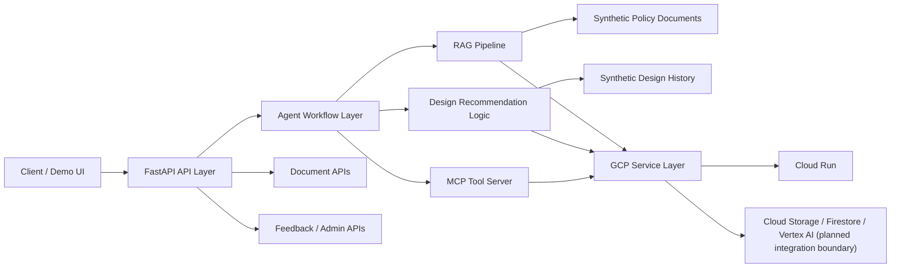

# GCP-based Insurance Design GenAI Agent PoC

보험 가입설계 업무를 지원하기 위한 GenAI Agent PoC 프로젝트입니다. 이 저장소는 약관 문서 RAG, 가입설계 이력 기반 추천, 설계 조건 변경, Agent Workflow, MCP-compatible Tool Server, GCP Cloud Run 배포 구조를 하나의 백엔드 아키텍처로 검증하는 것을 목표로 합니다.

이 프로젝트는 포트폴리오 및 MVP 검증을 위해 **synthetic sample 데이터만 사용**합니다. 실제 기업 내부 데이터, 실제 RFP 원문, 실제 고객정보, 실제 운영 API 명세는 포함하지 않습니다.

## 1. Project Overview

이 프로젝트는 보험 가입설계 지원을 위한 백엔드 중심 PoC입니다. 단순한 챗봇이 아니라, 문서 검색과 추천, 설계 변경, 도구 호출을 단계적으로 처리할 수 있는 구조를 만드는 데 초점을 두었습니다.

검증하려는 핵심 시나리오는 다음과 같습니다.

- 약관 및 상품 문서에서 관련 조항 검색
- 과거 가입설계 이력을 바탕으로 추천 방향 제시
- 고객 조건 변경에 따른 설계 수정
- Agent Workflow를 통한 다단계 처리
- MCP-compatible Tool Server를 통한 도메인 기능 분리
- GCP Cloud Run 기준 배포 구조 정리

현재 저장소는 완전한 운영 서비스보다는, 구조적 설계와 확장 가능한 경계 설계에 더 초점을 둔 형태입니다.

## 2. Why Refactoring

보험 설계 업무는 문서 의존도가 높고, 규칙 기반 판단이 많으며, 여러 단계를 거쳐야 하는 경우가 많습니다. 그래서 단일 `chat` endpoint 안에 모든 로직을 넣는 방식은 유지보수와 확장성 측면에서 한계가 있습니다.

이번 리팩토링 방향은 아래 목표를 위해 선택했습니다.

- `API`, `RAG`, `Agent`, `MCP Tools`, `Infrastructure`의 관심사 분리
- 향후 Vertex AI, Firestore, Cloud Storage 연동을 고려한 확장성 확보
- 기능별 테스트 가능 구조 확보
- Cloud Run 배포를 고려한 컨테이너 친화적 구성
- 포트폴리오에서 설계 의도를 명확하게 설명할 수 있는 구조 확보

## 3. Key Features

- 약관 문서 기반 `RAG Pipeline`
- 가입설계 이력 기반 추천 로직
- 설계 조건 변경을 반영하는 `design modification` 흐름
- LangGraph 스타일의 `Workflow Agent` 구조
- `MCP-compatible Tool Server` 기반 도구 분리
- `FastAPI` 기반 API 레이어
- `Cloud Run` 배포를 고려한 컨테이너 구성
- 실제 데이터가 아닌 synthetic sample 데이터만 사용하는 안전한 데모 구조

## 4. Architecture



주요 디렉터리 구조:

- `app/api`: `chat`, `documents`, `sessions`, `feedback`, `admin`, `health` endpoint
- `app/agents`: workflow state와 node, graph 구성
- `app/rag`: `parser`, `chunker`, `retriever`, `citation` 등 RAG 구성 요소
- `app/mcp_server`: MCP-compatible server와 tool 구현
- `app/services`: GCP 및 추천 로직 서비스 계층
- `data`: synthetic sample 약관, 가입설계 이력, 질문 데이터
- `tests`: API 및 로직 검증 테스트

## 5. Tech Stack

핵심 백엔드 스택:

- Python 3.11
- FastAPI
- Uvicorn
- Pydantic / pydantic-settings
- Pytest
- HTTPX

아키텍처 및 확장 대상:

- LangGraph 스타일 Workflow Agent
- MCP Tool Server 패턴
- GCP Cloud Run
- Cloud Storage / Firestore / Vertex AI 연동 경계
- `chroma_service` 기반 vector store 확장 포인트

## 6. RAG Pipeline

이 프로젝트의 RAG는 단일 함수가 아니라, 교체 가능한 단계형 파이프라인으로 설계되어 있습니다. 현재 MVP에서는 비용 절감을 위해 keyword 기반 retriever를 사용하지만, 이후 Vertex AI Embedding과 Gemini 기반 generation으로 교체할 수 있도록 경계를 분리해 두었습니다.

현재 검색 구조는 특정 상품 하나에 맞춘 튜닝이 아니라, 여러 보험상품군에 공통으로 적용할 수 있는 multi-product insurance RAG 전략으로 확장되었습니다. 상세 설계는 [docs/rag_pipeline.md](/Users/hwangseung-gi/codex-workspace/insurance-genai-agent-gcp/docs/rag_pipeline.md), [docs/retrieval_strategy.md](/Users/hwangseung-gi/codex-workspace/insurance-genai-agent-gcp/docs/retrieval_strategy.md), [docs/evaluation_plan.md](/Users/hwangseung-gi/codex-workspace/insurance-genai-agent-gcp/docs/evaluation_plan.md)를 참고할 수 있습니다.

의도한 RAG 흐름:

1. synthetic sample 약관 문서 로드
2. 문서 파싱 및 section 정리
3. 조항 단위 chunk 생성
4. 질문과 chunk 간 keyword 기반 관련도 계산
5. 상위 chunk 검색
6. citation 생성
7. template 기반 응답 생성
8. 이후 embedding / reranking / generation 단계로 확장

보험 도메인에서는 답변의 자연스러움만큼 근거 조항 추적 가능성이 중요하기 때문에, citation 중심 구조를 우선 설계했습니다.

## 7. Agent Workflow

`/api/v1/chat`은 현재 단일 template 응답이 아니라 Workflow Agent를 통해 처리됩니다. 초기 MVP에서는 rule-based intent classification을 사용하며, 이후 LLM 기반 intent/slot extraction으로 교체할 수 있게 구성했습니다.

현재 지원하는 intent:

- `policy_qa`
- `design_recommendation`
- `design_modification`
- `claim_document`
- `general`

주요 처리 흐름:

- `intent_node`: 질문 의도 분류
- `slot_extract_node`: `age_group`, `gender`, `product_name` 등 slot 추출
- `retrieval_node`: 약관 검색 수행
- `recommendation_node`: 가입설계 추천 수행
- `design_modify_node`: 현재 설계 수정
- `guardrail_node`: citation 없는 약관성 답변에 disclaimer 보강
- `response_node`: 최종 응답 조립

## 8. MCP Tool Server

MCP Tool Server는 Agent 내부에 모든 기능을 숨기지 않고, 도메인 기능을 `tool` 단위로 외부화할 수 있다는 점을 보여주기 위해 포함했습니다.

현재 구현된 tool:

- `policy_search_tool`: 기존 RAG retriever 호출
- `product_recommend_tool`: 가입설계 추천 서비스 호출
- `design_condition_tool`: 현재 설계에 rider add/remove 적용

이번 MVP에서는 실제 MCP SDK 대신 `MCP-compatible interface` 형태로 구현했습니다. 각 tool은 아래 공통 구조를 가집니다.

- `name`
- `description`
- `input_schema`
- `output_schema`
- `run(payload)`

이 구조 덕분에 이후 실제 MCP SDK로 전환할 때도 비즈니스 로직을 거의 그대로 재사용할 수 있습니다.

## 9. GCP Deployment

이 프로젝트는 `Cloud Run` 배포를 전제로 컨테이너 구성을 정리했습니다.

배포 특징:

- `python:3.11-slim` 기반 경량 이미지
- `uvicorn app.main:app`로 FastAPI 실행
- `PORT=8080` 기반 Cloud Run 호환 구성
- `Secret Manager` 사용을 전제로 한 환경변수 전략

기본 배포 흐름:

1. Docker image build
2. Artifact Registry push
3. Cloud Run deploy
4. 필요 시 Vertex AI, Firestore, Cloud Storage 연동

로컬 실행 예시:

```bash
python -m venv .venv
source .venv/bin/activate
pip install -r requirements.txt
uvicorn app.main:app --reload
```

컨테이너 entrypoint:

```bash
uvicorn app.main:app --host 0.0.0.0 --port 8080
```

## 10. API Specification

Base path: `/api/v1`

| Method | Endpoint | 설명 |
| --- | --- | --- |
| `GET` | `/health` | 헬스 체크 |
| `POST` | `/chat` | Workflow Agent 진입점 |
| `POST` | `/documents/upload` | synthetic sample 문서 업로드 placeholder |
| `POST` | `/documents/index` | 문서 인덱싱 placeholder |
| `GET` | `/sessions/{session_id}` | 세션 이력 조회 |
| `GET` | `/sessions/{session_id}/messages` | 채팅방 UI용 메시지 목록 조회 |
| `POST` | `/feedback` | 피드백 저장 |
| `GET` | `/admin/failed-questions` | fallback/실패 질문 조회 |
| `GET` | `/admin/statistics` | 관리자 통계 조회 |

대표 응답 필드:

- `session_id`
- `intent`
- `answer`
- `citations`
- `confidence_score`
- `follow_up_questions`
- `disclaimer`

현재 endpoint 일부는 PoC scaffold 단계이며, synthetic sample 응답 중심으로 동작합니다.

`/demo`는 실제 채팅방 형태의 웹 UI로 동작합니다. 브라우저 `localStorage`에 저장한 `session_id`를 기준으로 같은 대화 이력을 다시 불러오며, 사용자는 `document_id`를 직접 입력할 필요 없이 상품 선택 또는 전체 검색 토글만으로 질문할 수 있습니다. 답변 말풍선 하단에서 `citations`, `tool_trace`, `recommended_design`, `current_design`을 접기/펼치기 형태로 확인할 수 있고, Cloud Run 배포 URL에서도 동일한 시나리오를 데모할 수 있습니다.

## 11. Security Considerations

이 저장소는 공개 포트폴리오 및 데모를 안전하게 구성하기 위해 아래 원칙을 따릅니다.

- 실제 고객정보 저장 및 노출 금지
- 실제 보험사 내부 문서 미포함
- 실제 RFP 원문 미포함
- 실제 운영 API 계약 미포함
- 모든 샘플 데이터는 synthetic sample 기준
- 민감 연동은 코드 구조상 분리하고, 실제 값은 저장소에 두지 않음

운영 수준으로 확장하려면 아래 항목이 추가로 필요합니다.

- IAM 및 서비스 계정 권한 설계
- Secret Manager 기반 비밀값 관리
- 감사 로그 및 접근 통제
- 입력 필터링 / prompt guardrail
- 역할 기반 권한 관리

## 12. Cost Strategy

이번 PoC는 기능 검증 이전에 비용이 과도하게 늘어나지 않도록 설계했습니다.

- 초기에는 keyword retriever 기반으로 비용 없는 검색 검증
- retrieval / recommendation / generation 레이어 분리
- Cloud Run `min-instances=0`으로 scale-to-zero 활용
- `max-instances=1~2` 수준으로 확장 제한
- synthetic sample 데이터만 사용해 초기 저장/임베딩 비용 최소화
- Vertex AI는 실제 필요성이 확인된 뒤 점진적으로 활성화

이 방식은 기능 검증과 비용 통제를 함께 달성하기 위한 MVP 전략입니다.

## 13. Future Improvements

- 실제 LangGraph `StateGraph` 기반 orchestration으로 전환
- Vertex AI Embedding 기반 retriever 적용
- Gemini 기반 answer generation 적용
- recommendation logic 고도화
- citation score 및 answer evaluation 지표 추가
- MCP SDK 기반 실제 Tool Server 전환
- 인증, 감사 로그, RBAC 추가
- CI/CD 및 환경별 배포 분리
- 간단한 demo UI 추가

---
